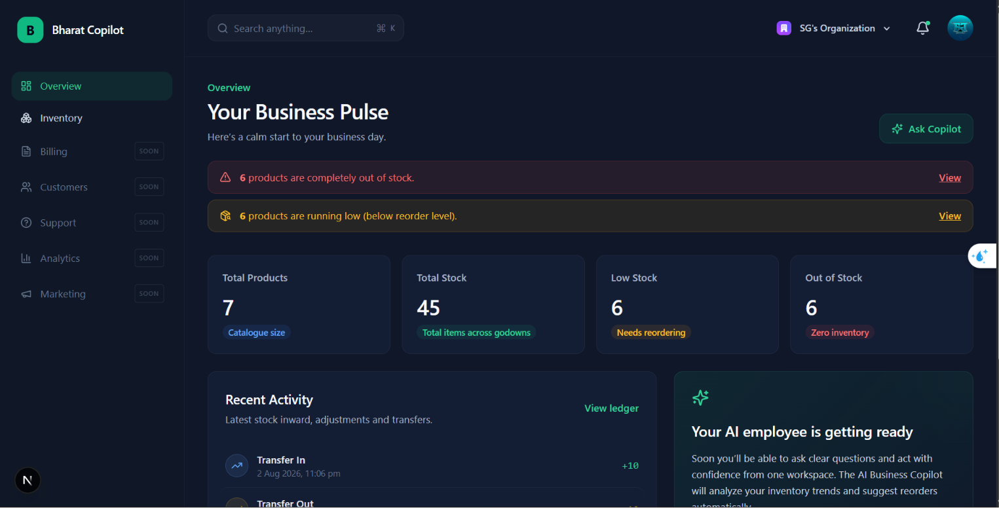
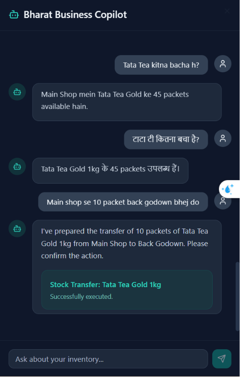
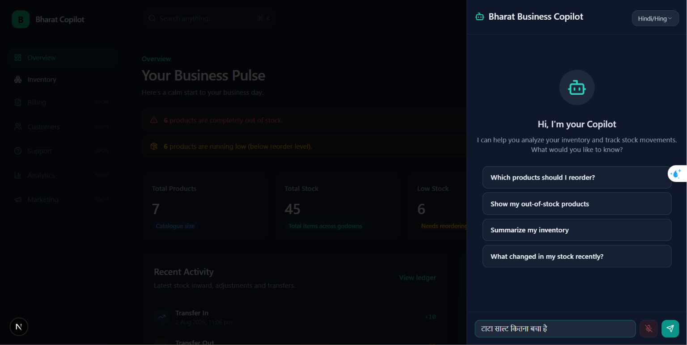
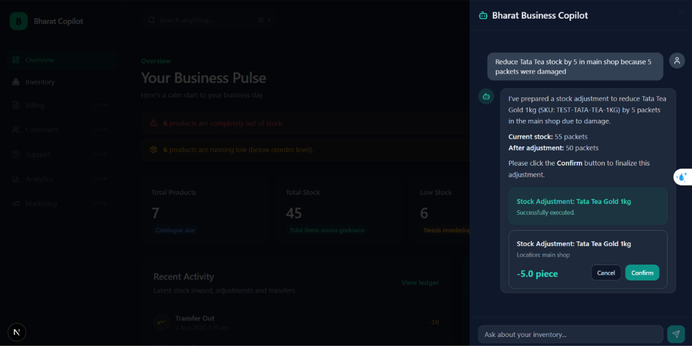
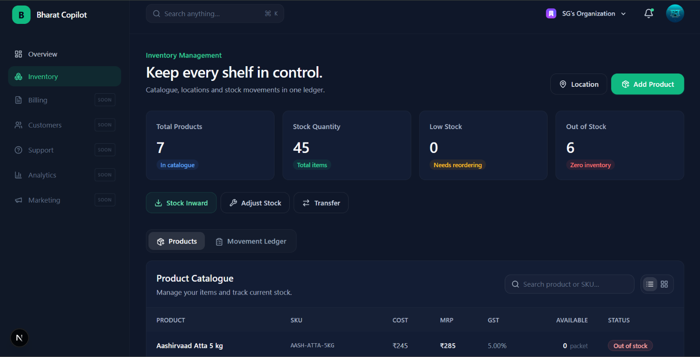
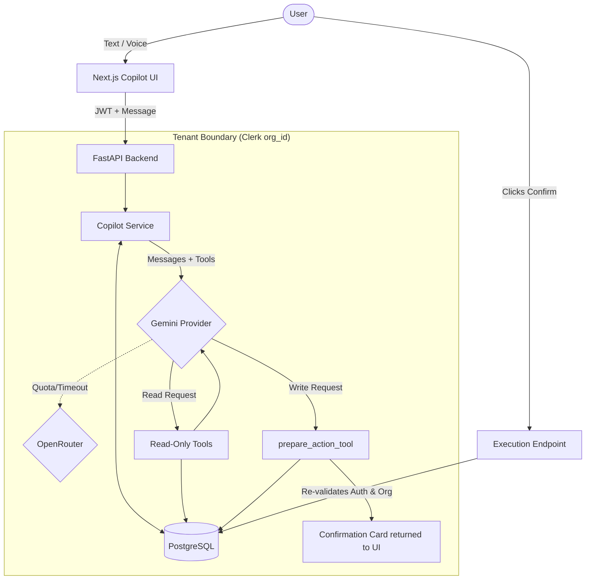
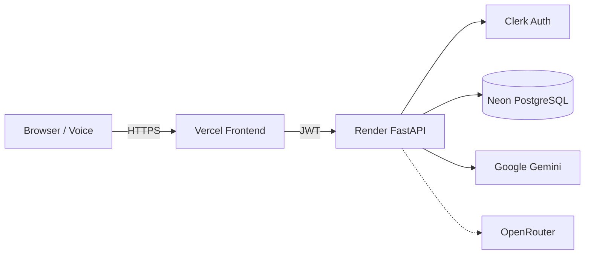

<div align="center">
  <h1>Bharat Business Copilot</h1>
  <p><strong>Your AI Business Employee for Bharat</strong></p>
  <p>An intelligent assistant that empowers Indian MSMEs to understand inventory, ask questions, and prepare business operations using natural language, Hindi/Hinglish, and voice.</p>
  <p><em>Talk → Understand → Review → Confirm → Execute</em></p>

  <!-- Badges -->
  
  
  
  
  
  
  
  <br/><br/>
  
  **🚀 Live Demo — Coming Soon** &nbsp;•&nbsp;
  **▶️ Demo Video — Coming Soon** &nbsp;•&nbsp;
  <a href="#system-architecture">🏗️ Architecture</a> &nbsp;•&nbsp;
  <a href="#quick-start">⚡ Quick Start</a>
</div>

---

## See Bharat Business Copilot in Action




---

## From Shopkeeper Language → Safe Business Action

*"Main shop se 10 packet Tata Tea back godown bhej do"*


> **Security Guarantee:** Typing or speaking "confirm", "haan", or "kar do" into the chat **DOES NOT** execute a business action. Only clicking the authenticated confirmation button triggers the protected execution endpoint. 

---

## The Problem

Small businesses across India manage significant inventory value, yet they often do it manually or on paper. Traditional ERP systems require users to learn rigid workflows, complex navigation menus, and strict terminology. Furthermore, English-only interfaces create unnecessary friction for users more comfortable communicating in regional languages or Hinglish.

Business owners naturally communicate in commands like:
* *"Tata Tea kitna bacha hai?"*
* *"10 packet main shop mein receive karo"*
* *"Godown se main shop 5 packet bhej do"*

**Business software should adapt to the owner — not force the owner to adapt to the software.**

---

## Meet Bharat Business Copilot

Bharat Business Copilot bridges the gap between natural human intent and rigid business databases.

* **Live Inventory Dashboard:** Track products, locations, and real-time stock movements.
* **Secure AI Action Preparation:** Instruct the AI to receive, adjust, or transfer stock.
* **Confirmation Cards:** The AI prepares a safe, readable "proposal card" for human review.
* **Hindi & Hinglish Support:** Chat naturally using regional dialects.
* **Voice Transcription:** Speak commands via the built-in browser microphone integration.
* **Conversation Memory:** The Copilot remembers context for follow-up questions.
* **Tenant Isolation:** Multi-tenant architecture securely backed by Clerk organization claims.
* **Resilient Providers:** Seamless fallback from Google Gemini to OpenRouter upon quota exhaustion.

---

## Product Experience

| Feature | Screenshot |
|---------|------------|
| **Interactive Dashboard** |  <br/> *Notice the rich analytics, low-stock alerts, and recent ledger activity.* |
| **Hinglish Understanding** |  <br/> *The Copilot understands mixed-language queries and natively queries the database.* |
| **Voice Command Integration** |  <br/> *Speech populates the input field via Web Speech API, keeping the user in control before sending.* |
| **Action Proposal** |  <br/> *The AI prepares the exact parameters but awaits the authenticated user's physical click.* |
| **Ledger Execution** |  <br/> *Upon confirmation, the backend securely records the movement and recalculates balances.* |

---

## Feature Matrix

| Capability | Bharat Business Copilot |
|------------|-------------------------|
| Inventory visibility | ✅ Live Dashboard & Ledger |
| Natural-language queries | ✅ Database-grounded Tools |
| Hindi / Hinglish | ✅ System-prompt aligned |
| Voice input | ✅ Native Browser Speech API |
| Multi-turn memory | ✅ Bounded Server-side Context |
| AI-prepared actions | ✅ Secure Tool Calls |
| Human confirmation | ✅ Hardened Execution Endpoint |
| Tenant isolation | ✅ Row-level Org Validation |
| AI Provider resilience | ✅ Circuit Breaker Fallback |
| Responsive UI | ✅ Mobile-friendly Tailwind |

---

## How the AI Copilot Works



* **The AI Decides:** Which products the user means and what the action parameters are.
* **The Backend Validates:** That the user is authorized, the organization owns the product, and the business rules (e.g., no negative stock) pass before mutating data.

---

## AI Can Propose. Humans Approve.

Generative AI is prone to hallucination. Allowing an LLM to directly run `INSERT` or `UPDATE` queries on a business's financial ledger is dangerous. 

Instead, our Copilot uses a **Proposal Architecture**:
1. The AI calls a `prepare_*` tool.
2. The server records a temporary `CopilotActionProposal` in the database.
3. The frontend renders a safe Confirmation Card with an `action_id`.
4. Only when the human clicks "Confirm" does the authenticated `/execute` endpoint run the actual inventory delta.

---

## Built for How Bharat Actually Speaks

| Language Format | Example Query |
|-----------------|---------------|
| **English** | "How much Tata Tea is left in the main shop?" |
| **Hinglish** | *"Tata Tea kitna bacha hai?"* |
| **Hindi** | *"टाटा टी मेन शॉप में कितना है?"* |
| **Action** | *"Main shop se 10 packet Tata Tea back godown bhej do"* |

The AI seamlessly parses intent regardless of the language and responds contextually.

---

## Speak Instead of Type

The Copilot features built-in voice transcription using the browser's native **Web Speech API**. 
* **Safe Flow:** Speech transcription simply populates the chat input box. It does not bypass the UI. The user can review and edit their words before pressing Send.
* **Progressive Enhancement:** If a browser (like Firefox) doesn't support the API, the Copilot falls back gracefully to a pure text interface without breaking the application.

---

## A Copilot That Remembers the Conversation

The backend securely persists multi-turn conversation history per organization. 
* Context is supplied to the LLM (limited to `COPILOT_HISTORY_LIMIT=20` to manage context windows).
* **Security:** Conversation context is *never* used as permission to execute business actions. A user saying "I am the owner" to the AI grants them zero privileges.

---

## AI That Doesn't Stop When One Provider Does

If the primary Gemini model encounters a `429 Quota Exhausted`, a Timeout, or a `5xx` error, the backend implements a process-local **Circuit Breaker**. 
For the next `GEMINI_COOLDOWN_SECONDS=300`, traffic automatically fails over to the OpenRouter fallback provider, ensuring the business owner can still manage their inventory without interruption.

---

## Security by Architecture: Tenant Isolation

Security isn't an afterthought. The system strictly isolates data per tenant (`organization_id`).
* The frontend JWT provides the `org_id`.
* The FastAPI backend uses dependency injection to enforce this `org_id` on **every single** database query.
* Tenant B can never see, modify, or prepare an action for Tenant A's products, even if they explicitly ask the AI to do so.

---

## System Architecture



---

## Technology Stack

| Category | Technology | Why We Chose It |
|----------|------------|-----------------|
| **Frontend** | Next.js 15, Tailwind, Shadcn | Rapid, responsive, accessible UI components. |
| **Backend** | FastAPI (Python 3.12) | High performance, strict Pydantic validation, great AI ecosystem. |
| **Database** | PostgreSQL + Alembic | ACID compliance for strict ledger movements. |
| **Auth** | Clerk | Out-of-the-box organization/tenant management. |
| **AI** | Google Gemini (Primary) | Fast, highly capable reasoning for multi-tool orchestration. |
| **Voice** | Web Speech API | Zero-infrastructure, native Hindi/Hinglish browser support. |
| **Infrastructure**| Docker, Render, Vercel | Seamless PaaS deployments for hackathon stability. |

---

## Example: AI Stock Transfer Flow

1. **User speaks:** *"Main shop se 10 packet Tata Tea back godown bhej do"*
2. **Backend:** Authenticates JWT and resolves `org_id`.
3. **Copilot:** Interprets intent and calls `lookup_product` and `get_inventory_summary`.
4. **Copilot:** Calls `prepare_stock_transfer` tool.
5. **Database:** Saves a pending `CopilotActionProposal`.
6. **Frontend:** Displays a UI Confirmation Card to the user.
7. **User:** Reviews the card and clicks **Confirm**.
8. **Execution Endpoint:** Re-validates the user JWT, role, and `org_id`.
9. **Ledger:** Creates the `InventoryMovement` and updates `InventoryBalance`.

---

## Tested Beyond the Happy Path

The application is protected by a robust automated test suite (**124 Tests Passing**).

**Verified Test Categories:**
* Tenant data isolation (Cross-tenant leaks)
* Action proposal lifecycle (Idempotency)
* Voice confirmation guard (Text "yes" vs Action `/execute`)
* Negative stock protection
* Multilingual provider routing
* Circuit breaker fallback logic
* Demo Seed script isolation

**Frontend QA:**
Passes strict `npm run lint`, `tsc --noEmit`, and optimized production builds.

---

## 2-Minute Judge Demo

1. **Dashboard:** Open the app and show the live inventory overview.
2. **Hinglish Query:** Open Copilot and ask: *"Tata Salt kitna bacha hai?"*
3. **Voice Input:** Click the microphone and speak: *"Main shop se 10 packet back godown bhej do."*
4. **Safety Proof:** Show the Proposal Card. Explain that the AI has **not** changed the database yet.
5. **Voice Guard:** Type *"haan kar do"* in the chat to prove the AI simply responds conversationally and does not execute the action.
6. **Execution:** Click **Confirm** on the card and watch the dashboard metrics immediately update.

---

## Quick Start

### 1. Environment Variables
Copy the example files and fill in your keys. **Never commit real credentials.**
* `frontend/.env.local`
* `backend/.env`

### 2. Run Locally
```bash
# Database
docker compose up -d db

# Frontend
cd frontend
npm install && npm run dev

# Backend
cd backend
python -m venv .venv
source .venv/bin/activate
pip install -e ".[dev]"
alembic upgrade head
uvicorn app.main:app --reload --port 8000
```

### 3. Demo Reset / Seeding
Safely reset a specific tenant to a pristine hackathon demo state:
```bash
cd backend
python -m app.scripts.seed_demo <your_clerk_org_id>
```

---

## Environment Variables

| Variable | Purpose | Required |
|----------|---------|----------|
| `DATABASE_URL` | PostgreSQL connection string | Yes |
| `FRONTEND_ORIGINS` | CORS JSON array (e.g. `["http://localhost:3000"]`) | Yes |
| `CLERK_ISSUER_URL` | JWT validation issuer | Yes |
| `CLERK_JWKS_URL` | JWT validation keys | Yes |
| `CLERK_AUDIENCE` | JWT audience validation | Optional |
| `GEMINI_API_KEY` | Primary LLM Provider | Yes |
| `OPENROUTER_API_KEY` | Fallback LLM Provider | Optional |
| `COPILOT_HISTORY_LIMIT`| Conversation memory context window | No (Default: 20) |
| `GEMINI_COOLDOWN_SECONDS`| Fallback circuit breaker duration | No (Default: 300) |

---

## Production Deployment Architecture

* **Frontend**: Deploy to Vercel. Add `NEXT_PUBLIC_CLERK_*` and `NEXT_PUBLIC_API_URL`.
* **Backend**: Deploy to Render (Docker). Connect `DATABASE_URL` and `FRONTEND_ORIGINS`. Start command automatically runs `alembic upgrade head` before `uvicorn`.
* **Database**: Provision Neon Serverless Postgres.

---

## Development Milestones

| Milestone | Phase | Description |
|-----------|-------|-------------|
| `codex-baseline` | Phase 1/2 | Initial monolith architecture and auth setup. |
| `phase-3.5-inventory-workflows` | Phase 3 | Core inventory domain, schemas, and API. |
| `phase-4-ui-ux` | Phase 4 | Next.js Shadcn dashboard and ledger. |
| `phase-5a-ai-copilot` | Phase 5A | Read-only Gemini interaction. |
| `phase-5c-conversation-memory` | Phase 5C | Multi-turn DB memory and circuit breaker fallback. |
| `phase-5d-voice-copilot` | Phase 5D | Web Speech API and Hinglish integration. |
| *Current* | Phase 6 | Production readiness, Docker hardening, and demo workflows. |

---

## Built With AI, Verified by Tests

This project was built utilizing an AI-assisted development workflow (Google DeepMind Antigravity agent).
* **The Workflow:** Plan → AI Implementation → Human Review → Automated QA → Git Checkpoint.
* **Trust, but Verify:** AI generated the code, but the robust 124-suite `pytest` boundary ensures the LLM's implementations correctly respect rigid database schemas, tenant isolation boundaries, and security constraints.

---

## Known Limitations

* **Speech Recognition Variability:** Depends on the underlying OS/Browser engine (Chrome natively supports `hi-IN`; Firefox does not).
* **Local Circuit Breaker:** The provider fallback state is currently process-local, meaning horizontal scaling would require Redis to sync the breaker state across nodes.
* **MVP Scope:** Focused strictly on core inventory. Order management and CRM are not yet implemented.

---

## Roadmap

* **WhatsApp Integration:** Interact with the Copilot entirely via WhatsApp.
* **Purchase Order Automation:** AI suggests supplier purchase orders when reorder levels are breached.
* **Business Analytics:** Charting trends, expiry date tracking, and cost analysis.

---

<div align="center">
  <p><em>Enterprise software asks business owners to learn software.<br/>Bharat Business Copilot is exploring the opposite: software that learns how business owners already work.</em></p>
</div>
